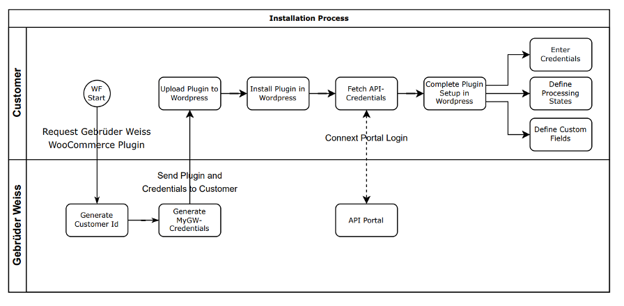

# Installation Guide

The Gebrüder Weiss Woocommerce Plugin allows the management and creation of logistic orders for WooCommerce, which are sent to Gebrüder Weiss via the logistics Order API.

## Process Diagram


*Figure 1: Schematic of the installation process and the steps to obtain the required credentials and configure the plugin for use.*

## Plugin Requirements
The following requirements need to be fulfilled to be able to use the plugin.

- PHP > 7.3
- WooCommerce installed & activated
- Plugin Credentials

## Plugin Credentials

The following information is required to use the plugin and secure the process of order creation:

The **Customer Id** is a unique identifier of your shop set by Gebrüder Weiss and is required to attribute orders to your shop. It can be found in the E-Mail sent to you by Gebrüder Weiss.

The **Consumer Key** and **Consumer Secret** are required to authenticate requests made using the logistics-order-API, which is used to send orders made within WooCommerce to Gebrüder Weiss. To obtain these credentials follow the steps below:

1. Navigate to [https://developer.test.gw.connext.com/devportal/apis](https://developer.test.gw.connext.com/devportal/apis) and log in using the credentials found in the communication sent to you by Gebrüder Weiss.
2. Select **logistics-order-API** and navigate to the Tab labelled **Credentials.**
3. Select the desired Application and click on **SANDBOX KEYS** or **PROD KEYS** to view the sandbox or production credentials.
4. Copy the **Consumer Key** and **Consumer Secret.**

 

*Figure 4: The tile within the API-Portal corresponding to the logistics-order-api and the sidebar with the Tab __credentials__* 


*Figure 5: The fields for Consumer Key and Secret within the Tab **Credentials** for the logistics-order-api*

## Wordpress Installation Process

### Manually
To install the Gebrüder Weiss Woocommerce Plugin the following steps must be taken: 

1. Ensure that the WordPress-site fulfils the requirements listed above.
2. Click on Upload Plugin and select the zip-file of the plugin sent via E-Mail to upload the plugin to WordPress. 
3. Click on the button Install Now and wait for the installation process to finish. 
4. Activate the plugin by clicking on Activate Plugin after the installation process has finished or by clicking on Activate in the list of installed plugins. 

More information on the installation process and troubleshooting can be found in the FAQ.


*Figure 2: The screen shown when the button Upload Plugin in Step 2 was clicked on. Clicking on Install Now will start the installation process for the plugin provided as zip-file.*


*Figure 3: The list entry for the Gebrüder Weiss Woocommerce Plugin within wordpress. Pressing on Activate allows the activation of the plugin.*

### Via Composer
The plugin is also available via [packagist](https://packagist.org/packages/towa/gebrueder-weiss-woocommerce), if you prefer an installation via composer.
If you have composer set up you can install the plugin with 
```bash
composer require towa/gebrueder-weiss-woocommerce
```

## Plugin Configuration

To configure the plugin for use, navigate to Tab **Settings** **à** **Gebrüder Weiss WooCommerce.**

There are three groups of settings that need to be configured to use the plugin:

### Settings Tab Account 
Contains the credentials to authenticate the plugin and create logistic orders for Gebrüder Weiss. The required information can be obtained following the instructions in the previous section. The credentials are validated whenever new information is entered, and a message will be shown whether the credentials were validated successfully or not.

| Setting       | Description                                                                                                |
| ------------- | ---------------------------------------------------------------------------------------------------------- |
| Customer Id   | The unique identifier of your shop set by Gebrüder Weiss.                                                  |
| Client Id     | The Client ID or Consumer Key, which is required to generate an access token and make API-requests.        |
| Client Secret | The Client Secret or Consumer Secret, which is required to generate an access token and make API-requests. |


*Figure 6: Settings Tab for Account settings in Plugin*

### Settings Tab Fulfillment

Defines the WooCommerce states for which the processing of orders by Gebrüder Weiss is started and which state an order should be set to if the processing was successful or failed. If any of the fields is not defined an error message is shown indicating which field has yet to be defined.

| Setting                 | Description                                                                                                                                |
| ----------------------- | ------------------------------------------------------------------------------------------------------------------------------------------ |
| Fulfillment State       | Orders in this state are ready to be shipped and start the processing of the Order by Gebrüder Weiss.                                      |
| Pending State           | Orders in this state are currently being handled by Gebrüder Weiss. This state exists to differentiate between Wocommerce's default on hold state (which is used by payment providers). Defaults to "on-hold". If a custom state should be used, it has to be created. An explanation on how this can be achieved can be found [here](https://woocommerce.com/de-at/document/addmodify-states/):                                                                                                                                           |
| Fulfilled State         | Processing of the order has been successful. The state is updated and set to the defined state within WooCommerce.                         |
| Fulfillment Error State | An error was encountered during processing of the order. The order has been updated and set to the defined error state within WooCommerce. |


*Figure 7: Settings Tab for Fullfillment Settings in Plugin. Define which states should be used by the Plugin*

### Settings Tab Order

Define the *custom fields* used to hold the order id assigned by Gebrüder Weiss to the order, a tracking link to track delivery progress and information on the used carrier. If any of the fields are not defined an error message is shown indicating which field has yet to be defined.

| Setting                   | Description                                                                                       |
| ------------------------- | ------------------------------------------------------------------------------------------------- |
| Order Id                  | The unique identifier set by the plugin to identify your order once it is sent to Gebrüder Weiss. |
| Tracking Link             | A tracking link to track the delivery progress of the shipment.                                   |
| Carrier Information Field | The name of the Carrier used for shipment                                                         | 


*Figure 8: Settings Tab for Order Settings in Plugin. Define in which custom fields the information should be stored.*